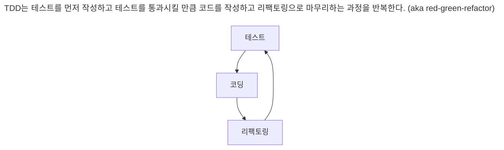

# TDD 시작
## TDD 란?
기능을 검증하는 테스트 코드를 먼저 만든다. 이 과정에서
1. 테스트 대상이 될 클래스 이름
2. 메서드 이름
3. 파라미터 개수
4. 리턴 타입

을 고민했다.

```java
public class CalculatorTest {
    
    @Test
    void plus() {
        int result = Calculator.plus(1, 2);
        assertThat(result).isEqualTo(3);
    }
}
```

테스트 코드를 작성한 뒤에는 컴파일 오류를 없애기 위해 클래스와 메서드를 작성했다.
```java
public class Calculator {
    public static int plus(int a, int b) {
        return 0;
    }
}
```

단순히 3을 리턴해서 테스트를 통과할 만큼만 코드 구현
```diff
public class Calculator {
    public static int plus(int a, int b) {
-        return 0;
+        return 3;
    }
}
```

테스트 추가

```diff
public class CalculatorTest {
    
    @Test
    void plus() {
        int result = Calculator.plus(1, 2);
        assertThat(result).isEqualTo(3);
+        assertThat(Calculator.plus(4, 1)).isEqualTo(5);
    }
}
```

테스트가 통과하도록 수정

```diff
public class Calculator {
    public static int plus(int a, int b) {;
-        return 3;
+        return a + b;
    }
}
```

## TDD 예: 암호 검사기
검사할 규칙
1. 길이가 8글자 이상
2. 0 부터 9 사이의 숫자를 포함
3. 대문자 포함

- 세 규칙을 모두 충족하면 암호는 강함이다.
- 2개의 규칙을 충족하면 함호는 보통이다.
- 1개 이하의 규칙을 충족하면 암호는 약함이다.

### 첫 번째 테스트: 모든 규칙을 충족하는 경우
```java
public class PasswordStrengthMeterTest {

    @Test
    void meetsAllCriteria_Then_Strong() {
        PasswordStrengthMeter meter = new PasswordStrengthMeter();
        PasswordStrength result = meter.meter("ab12!@AB");

        assertThat(result).isEqualTo(PasswordStrength.STRONG);
    }
}
```

테스트를 통과할 정도로 개발 진행
```java
public enum PasswordStrength {
    STRONG
}
```
```java
public class PasswordStrengthMeter {

    public PasswordStrength meter(String password) {
        return PasswordStrength.STRONG;
    }
}
```

테스트 추가
```diff
public class PasswordStrengthMeterTest {

    @Test
    void meetsAllCriteria_Then_Strong() {
        PasswordStrengthMeter meter = new PasswordStrengthMeter();
        PasswordStrength result = meter.meter("ab12!@AB");
        
        assertThat(result).isEqualTo(PasswordStrength.STRONG);

+        PasswordStrength result2 = meter.meter("abc1!Add");
+
+        assertThat(result2).isEqualTo(PasswordStrength.STRONG);
    }
}
```

### 두 번째 테스트: 길이만 8글자 미만이고 나머지 조건은 충족하는 경우
길이가 8글자 미만인 경우 추가
```java
public class PasswordStrengthMeterTest {
    @Test
    void meetsOtherCriteria_except_for_Length_Then_Normal() {
        PasswordStrengthMeter meter = new PasswordStrengthMeter();
        PasswordStrength result = meter.meter("ab12!@A");

        assertThat(result).isEqualTo(PasswordStrength.NORMAL);
    }
}
```
```diff
public enum PasswordStrength {
    STRONG,
+    NORMAL
}

```

### 세 번째 테스트: 숫자를 포함하지 않고 나머지 조건은 충족하는 경우
```java
@Test
void meetsOtherCriteria_except_for_Length_Then_Normal2() {
    PasswordStrengthMeter meter = new PasswordStrengthMeter();
    PasswordStrength result = meter.meter("ab!@ABqwer");

    assertThat(result).isEqualTo(PasswordStrength.NORMAL);
}
```

암호가 숫자를 포함했는지 판단하는 코드 추가
```diff
public class PasswordStrengthMeter {

    public PasswordStrength meter(String password) {
        if (password.length() < 8) {
            return PasswordStrength.NORMAL;
        }

+        boolean containsNum = false;
+        for (char ch : password.toCharArray()) {
+            if (ch >= '0' && ch <= '9') {
+                containsNum = true;
+                break;
+            }
+        }
+        if (!containsNum) return PasswordStrength.NORMAL;

        return PasswordStrength.STRONG;
    }
}
```

코드 리팩터링
```diff
public class PasswordStrengthMeter {

    public PasswordStrength meter(String password) {
        if (password.length() < 8) {
            return PasswordStrength.NORMAL;
        }

-        boolean containsNum = false;
-        for (char ch : password.toCharArray()) {
-            if (ch >= '0' && ch <= '9') {
-                containsNum = true;
-                break;
-            }
-        }
+        boolean containsNum = meetsContainingNumberCriteria(password);
        if (!containsNum) return PasswordStrength.NORMAL;

        return PasswordStrength.STRONG;
    }
    
+    private boolean meetsContainingNumberCriteria(String password) {
+        for (char ch : password.toCharArray()) {
+            if (ch >= '0' && ch <= '9') {
+                return true;
+            }
+        }
+
+        return false;
+    }
}
```

### 코드 정리: 테스트 코드 정리
테스트 코드도 코드이기 때문에 유지보수 대상이다.

```diff
public class PasswordStrengthMeterTest {

+    private PasswordStrengthMeter meter = new PasswordStrengthMeter();

    // 생략

+    private void assertStrength(String password, PasswordStrength expStr) {
+        PasswordStrength result = meter.meter(password);
+
+        assertThat(result).isEqualTo(expStr);
+    }
}
```

### 네 번째 테스트: 값이 없는 경우

null 인 경우 INVALID를 return 한다.

```diff
public class PasswordStrengthMeter {

    public PasswordStrength meter(String password) {
+        if (password == null || password.isEmpty()) return PasswordStrength.INVALID;

        if (password.length() < 8) {
            return PasswordStrength.NORMAL;
        }

        boolean containsNum = meetsContainingNumberCriteria(password);
        if (!containsNum) return PasswordStrength.NORMAL;

        return PasswordStrength.STRONG;
    }
    
    // ...
}
```

### 다섯 번째 테스트: 대문자를 포함하지 않고 나머지 조건을 충족하는 경우

대문자를 포함하지 않는 테스트 추가

```java
@Test
void meetsOtherCriteria_except_for_Uppercase_Then_Normal() {
    assertStrength("ab12!@df", NORMAL);
}
```

```diff
public PasswordStrength meter(String password) {
    if (password == null || password.isEmpty()) return PasswordStrength.INVALID;

    if (password.length() < 8) {
        return PasswordStrength.NORMAL;
    }

+    boolean containUpp = meetsContainingUppercaseCriteria(password);
+    if (!containUpp) return PasswordStrength.NORMAL;

    boolean containsNum = meetsContainingNumberCriteria(password);
    if (!containsNum) return PasswordStrength.NORMAL;

    return PasswordStrength.STRONG;
}

+ private boolean meetsContainingUppercaseCriteria(String password) {
+     for (char ch : password.toCharArray()) {
+         if (Character.isUpperCase(ch)) {
+             return true;
+         }
+     }
+ 
+     return false;
+ }
```

### 여섯 번째 테스트: 길이가 8글자 이상인 조건만 충족하는 경우

8글자 이상인 조건만 충족하는 테스트 추가
```java
@Test
void meetsOnlyLengthCriteria_Then_Weak() {
    assertStrength("abdefghi", WEAK);
}
```

코드 리팩터링 후 8글자 이상이 조건만 충족하는 경우 추가
```diff
public PasswordStrength meter(String password) {
    if (password == null || password.isEmpty()) return PasswordStrength.INVALID;

+    boolean lengthEnough = password.length() >= 8;
    boolean containUpp = meetsContainingUppercaseCriteria(password);
    boolean containsNum = meetsContainingNumberCriteria(password);
    
-    if (password.length() < 8) {
-        return PasswordStrength.NORMAL;
-    }

+    if (lengthEnough && !containUpp && !containsNum) return PasswordStrength.WEAK;

+    if (!lengthEnough) return PasswordStrength.NORMAL;
    if (!containUpp) return PasswordStrength.NORMAL;
    if (!containsNum) return PasswordStrength.NORMAL;

    return PasswordStrength.STRONG;
}
```

### 일곱 번째 테스트: 숫자 포함 조건만 충족하는 경우
```java
@Test
void meetsOnlyNumCriteria_Then_Weak() {
    assertStrength("12345", WEAK);
}
```
```diff
public PasswordStrength meter(String password) {
    if (password == null || password.isEmpty()) return PasswordStrength.INVALID;

    boolean lengthEnough = password.length() >= 8;
    boolean containUpp = meetsContainingUppercaseCriteria(password);
    boolean containsNum = meetsContainingNumberCriteria(password);

    if (lengthEnough && !containUpp && !containsNum) return PasswordStrength.WEAK;
+    if (!lengthEnough && !containUpp && containsNum) return PasswordStrength.WEAK;

    if (!lengthEnough) return PasswordStrength.NORMAL;
    if (!containUpp) return PasswordStrength.NORMAL;
    if (!containsNum) return PasswordStrength.NORMAL;

    return PasswordStrength.STRONG;
}
```

### 여덟 번째 테스트: 대문자 포함 조건만 충족하는 경우
```java
@Test
void meetsOnlyUpperCriteria_Then_Weak() {
    assertStrength("ABZEF", PasswordStrength.WEAK);
}
```
```diff
public PasswordStrength meter(String password) {
    if (password == null || password.isEmpty()) return PasswordStrength.INVALID;

    boolean lengthEnough = password.length() >= 8;
    boolean containUpp = meetsContainingUppercaseCriteria(password);
    boolean containsNum = meetsContainingNumberCriteria(password);

    if (lengthEnough && !containUpp && !containsNum) return PasswordStrength.WEAK;
    if (!lengthEnough && !containUpp && containsNum) return PasswordStrength.WEAK;
+    if (!lengthEnough && containUpp && !containsNum) return PasswordStrength.WEAK;

    if (!lengthEnough) return PasswordStrength.NORMAL;
    if (!containUpp) return PasswordStrength.NORMAL;
    if (!containsNum) return PasswordStrength.NORMAL;

    return PasswordStrength.STRONG;
}
```

### 코드 정리: meter() 메서드 리팩토링
```java
if (lengthEnough && !containUpp && !containsNum) return PasswordStrength.WEAK;
if (!lengthEnough && !containUpp && containsNum) return PasswordStrength.WEAK;
if (!lengthEnough && containUpp && !containsNum) return PasswordStrength.WEAK;
```
세 조건 중에서 한 조건만 충족하는 경우 암호 강도가 약하다는 것을 구현한 것이다.

```java
if (!lengthEnough) return PasswordStrength.NORMAL;
if (!containUpp) return PasswordStrength.NORMAL;
if (!containsNum) return PasswordStrength.NORMAL;
```
하나의 조건만 성립하지 않을 때 암호 강도가 보통이라는 것을 구현한 것이다.

**즉 조건을 충족하는 개수로 변경할 수 있다.**

```diff
public PasswordStrength meter(String password) {
+    int metCounts = 0;
    
    if (password == null || password.isEmpty()) return PasswordStrength.INVALID;

    boolean lengthEnough = password.length() >= 8;
    boolean containUpp = meetsContainingUppercaseCriteria(password);
    boolean containsNum = meetsContainingNumberCriteria(password);
    
-    if (lengthEnough && !containUpp && !containsNum) return PasswordStrength.WEAK;
-    if (!lengthEnough && !containUpp && containsNum) return PasswordStrength.WEAK;
-    if (!lengthEnough && containUpp && !containsNum) return PasswordStrength.WEAK;

-    if (!lengthEnough) return PasswordStrength.NORMAL;
-    if (!containUpp) return PasswordStrength.NORMAL;
-    if (!containsNum) return PasswordStrength.NORMAL;

+    if (lengthEnough) metCounts++;
+    if (containUpp) metCounts++;
+    if (containsNum) metCounts++;
    
+    if (metCounts == 1) return PasswordStrength.WEAK;
+    if (metCounts == 2) return PasswordStrength.NORMAL;

    return PasswordStrength.STRONG;
}
```

### 아홉 번째 테스트: 아무 조건도 충족하지 않은 경우
```java
@Test
void meetsNoCriteria_Then_Weak() {
    assertStrength("abc", WEAK);
}
```

metCounts == 1에서 metCounts <= 1 로 수정
```diff
public PasswordStrength meter(String password) {
        int metCounts = 0;

        if (password == null || password.isEmpty()) return PasswordStrength.INVALID;

        boolean lengthEnough = password.length() >= 8;
        boolean containUpp = meetsContainingUppercaseCriteria(password);
        boolean containsNum = meetsContainingNumberCriteria(password);

        if (lengthEnough) metCounts++;
        if (containUpp) metCounts++;
        if (containsNum) metCounts++;

-        if (metCounts == 1) return PasswordStrength.WEAK;
+        if (metCounts <= 1) return PasswordStrength.WEAK;
        if (metCounts == 2) return PasswordStrength.NORMAL;

        return PasswordStrength.STRONG;
    }
```

### 코드 정리: 코드 가독성 개선
```diff
public PasswordStrength meter(String password) {
-    int metCounts = 0;
    if (password == null || password.isEmpty()) return PasswordStrength.INVALID;

+    int metCounts = getMetCriteriaCounts(password);

-    boolean lengthEnough = password.length() >= 8;
-    boolean containUpp = meetsContainingUppercaseCriteria(password);
-    boolean containsNum = meetsContainingNumberCriteria(password);

-    if (lengthEnough) metCounts++;
-    if (containUpp) metCounts++;
-    if (containsNum) metCounts++;

    if (metCounts <= 1) return PasswordStrength.WEAK;
    if (metCounts == 2) return PasswordStrength.NORMAL;

    return PasswordStrength.STRONG;
}

+ private int getMetCriteriaCounts(String password) {
+     int metCounts = 0;

+     if (password.length() >= 8) metCounts++;
+     if (meetsContainingUppercaseCriteria(password)) metCounts++;
+     if (meetsContainingNumberCriteria(password)) metCounts++;
 
+     return metCounts;
+ }
```

## TDD 흐름


### 빠른 피드백
TDD가 주는 이점은 코드 수정에대한 피드백이 빠르다는 점이다.
새로운 코드를 추가하거나 기존 코드를 수정하면 테스트를 돌려서 해당 코드가 올바른지 바로 확인할 수 있다.